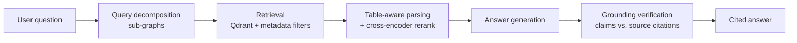
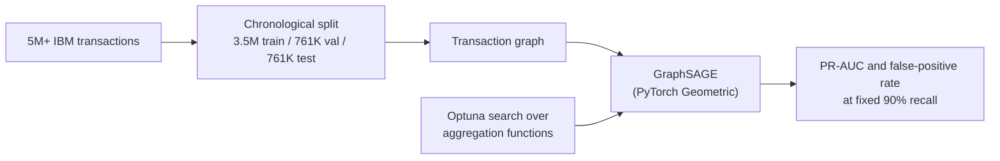
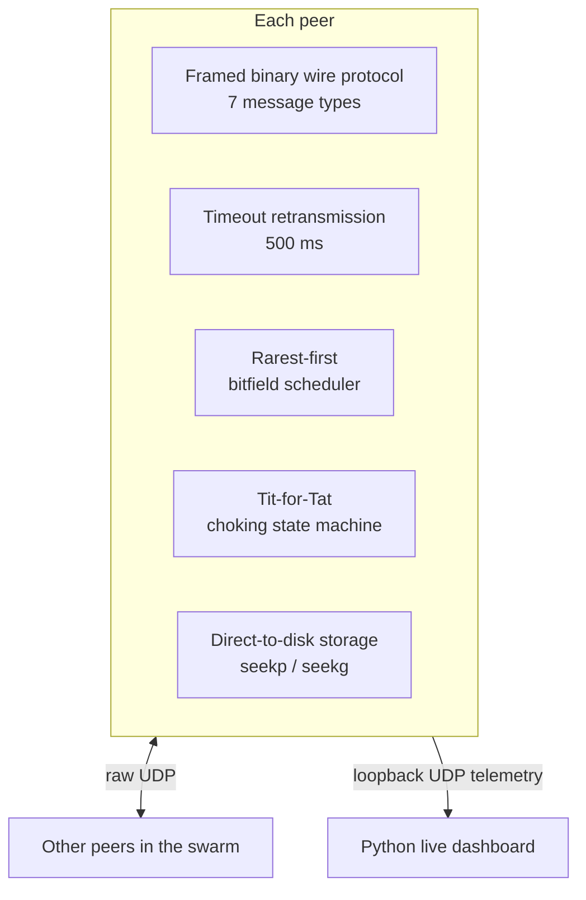

<div align="center">


<br/>
<p align="center">
  <a href="https://www.linkedin.com/in/ishaan-maheshwari-967741292">
    
  </a>

  <a href="mailto:ishaan.maheshwari101@gmail.com">
    
  </a>
</p>


</div>


## About

**Integrated B.Tech (IT) + MBA student at ABV-IIITM Gwalior** (2023 – 2028). I work where machine learning meets real systems: retrieval pipelines that have to be fast *and* grounded, graph models that have to beat a baseline on honest splits, and network protocols you can watch fail in Wireshark.

> **The thesis behind what I build:** a system isn't done when it works once. It's done when I can put a number on it (latency, recall, false-positive rate) and explain why it moved.

### Quick facts

| | |
|---|---|
| **Studying** | Integrated B.Tech IT + MBA, ABV-IIITM Gwalior, Aug 2023 – May 2028 |
| **Based in** | Gwalior, India |
| **Languages** | C++, Python, JavaScript, SQL, C |
| **Focus areas** | RAG & LLM orchestration · graph ML · distributed systems · network programming |
| **Problem solving** | 500+ DSA problems solved in C++ on LeetCode |
| **Entrance exam** | JEE Main 2023 · 98.6 percentile among 1.1M+ candidates |
| **Reach me** | ishaan.maheshwari101@gmail.com |

### Project timeline

| When | Project | One-line result |
|---|---|---|
| Aug 2026 | SEC Financial Intelligence RAG Engine | 7.25 ms P50 retrieval pipeline with claim-level grounding checks |
| Jan 2026 | GraphSAGE AML Monitoring | 18.3x PR-AUC over rules, 80% fewer false positives |
| Sep 2025 | Decentralized P2P File Sharing | Trackerless C++17 protocol over raw UDP with zero-drop recovery |


<div align="center">


<h2>SELECTED WORK</h2>


</div>

### [SEC Financial Intelligence RAG Engine](https://github.com/ishaaaan17/financial-intelligence-rag) — Autonomous Multi-Hop RAG over 10-K / 10-Q Filings

> `[ LangGraph ] [ Qdrant ] [ RAG ] [ grounding verification ]`

Financial filings are a hard retrieval target: the answers live in tables, questions often span several quarters, and a single hallucinated number is worse than no answer. This is an autonomous, multi-hop retrieval pipeline for SEC 10-K and 10-Q analysis, orchestrated as **LangGraph state machines** over a **Qdrant** vector store.



| Metric | Result |
|---|---|
| Latency | **7.25 ms P50 · 17.76 ms P95** |
| Metadata isolation | **100%** (enforced by filtering at the vector-database layer) |
| Table retrieval | **100% Top-4** on numerical queries |

**Design decisions**
- **Tables are first-class.** Custom PDF table parsing plus cross-encoder reranking lets numerical queries reach the table that holds the answer instead of the prose around it.
- **Comparisons are decomposed.** A question across quarters becomes sub-questions in query-decomposition sub-graphs, each retrieved and answered on its own.
- **Nothing ships unverified.** Automated grounding-verification nodes check each generated claim against its source citation, which is what removes hallucinated comparative metrics.
- **Filings never bleed into each other.** Metadata filtering at retrieval time keeps one company's or period's chunks out of another's answer.

`Python` `LangGraph` `Qdrant` `AWS EC2` `Docker` `FastAPI` `Streamlit` `cross-encoder reranking` `query decomposition`

---

### [GraphSAGE AML Transaction Monitoring](https://github.com/ishaaaan17/aml-transaction-monitoring) — Graph Neural Networks for Money-Mule Detection

> `[ GraphSAGE ] [ PyTorch Geometric ] [ XGBoost ] [ fraud / AML ]`

Money laundering is a graph problem: the signal is in how funds move between accounts, not in any one transaction. I modeled **5M+ IBM transactions** as a graph and trained a **GraphSAGE** classifier to catch structural layering patterns that row-level models miss.



| Model | PR-AUC | Notes |
|---|---|---|
| Rule baseline | 0.0089 | starting point |
| Tuned XGBoost | not listed | GraphSAGE is 2x better |
| **GraphSAGE** | **0.1633** | **18.3x** over rules, **2x** over XGBoost |

| At fixed 90% recall | False-positive rate |
|---|---|
| Before | 33.3% |
| **After** | **6.6%** (80% reduction) |

**Design decisions**
- **Honest evaluation first.** Strict chronological train/val/test splits (3.5M / 761K / 761K rows) remove lookahead feature leakage, so the numbers reflect what the model would do on future data.
- **Right metric for rare events.** PR-AUC and false positives at a fixed recall match how a compliance team feels the cost: alert workload.
- **Tuned baselines.** XGBoost was tuned too, so the 2x gain comes from modeling relational flows, not from a weak opponent.
- **Search the architecture, not just the learning rate.** Optuna ran across GNN aggregation functions.

`Python` `PyTorch Geometric` `GraphSAGE` `XGBoost` `Optuna` `PR-AUC` `leakage-free evaluation`

---

### [Decentralized P2P File Sharing Engine](https://github.com/ishaaaan17/p2p-file-sharing) — Trackerless Protocol over Raw UDP in C++17

> `[ C++17 ] [ UDP / Winsock ] [ protocol design ] [ game theory ]`

A peer-to-peer file-sharing protocol built from the socket up, with no tracker and no framework. UDP gives no delivery guarantees, so reliability, scheduling, and fairness all had to be designed into the protocol itself.



| Layer | What it does |
|---|---|
| **Wire protocol** | Custom 7-type framed binary format over raw UDP sockets |
| **Reliability** | 500 ms timeout-based retransmission, zero-drop recovery across multi-node swarms |
| **Scheduling** | Rarest-first bitfield scheduler speeds up piece distribution across the swarm |
| **Fairness** | Game-theoretic Tit-for-Tat choking state machine enforces bandwidth reciprocity and discourages leeching |
| **Storage** | Pre-allocated files with random-access writes, so memory stays flat as files grow |
| **Observability** | Live metrics streamed to a Python dashboard over loopback UDP; protocol debugged in Wireshark |

`C++17` `Winsock` `UDP sockets` `CMake` `Wireshark` `binary protocol design` `rarest-first scheduling` `Tit-for-Tat` `Streamlit`

---

## What these projects have in common

| Habit | Where it shows up |
|---|---|
| **Measure, then claim** | P50/P95 latency, PR-AUC, false-positive rate at fixed recall |
| **Evaluate honestly** | Chronological splits, tuned baselines, grounding checks on generated claims |
| **Own the whole stack** | Raw sockets and wire format in C++, GNN training in PyTorch, orchestration in LangGraph |
| **Make it inspectable** | Wireshark traces, live telemetry dashboard, citations on every answer |


```
──────────────────────────────  A R S E N A L  ──────────────────────────────
```

<div align="center">


</div>

| Area | Tools and topics |
|---|---|
| **Languages** | C++, Python, JavaScript, SQL, C |
| **ML & AI** | PyTorch, PyTorch Geometric, GraphSAGE, XGBoost, scikit-learn, LLMs, RAG pipelines, feature engineering, NLP |
| **Systems & backend** | Distributed systems, multithreading, concurrency, TCP/UDP socket programming, Winsock, REST APIs, FastAPI, Docker, Docker Compose, Linux |
| **Infra & tooling** | AWS EC2, Qdrant, Git, GitHub Actions, CI/CD, CMake, Wireshark, GoogleTest |
| **Coursework** | Data Structures & Algorithms · OOP · Operating Systems · Computer Networks · DBMS · Distributed Systems · Systems Programming |


## Beyond code

- **Problem solving:** 500+ Data Structures and Algorithms problems solved in C++ on LeetCode.
- **Leadership & communication:** managed written technical documentation, oral presentations, and cross-functional operations for 5+ flagship events during the Annual Technical Festival.
- **Academics:** JEE Main 2023, 98.6 percentile among 1.1M+ candidates nationwide.


```
────────────────────  C O M M I T   H I S T O R Y  ────────────────────
```

<div align="center">


<br/><br/>


<br/><br/>

## Let's talk

If you're building something where speed, correctness, or reliability has to be proven rather than assumed, I'd like to hear about it.


<br/>

[](mailto:ishaan.maheshwari101@gmail.com)
[](https://www.linkedin.com/in/ishaan-maheshwari-967741292)


</div>
