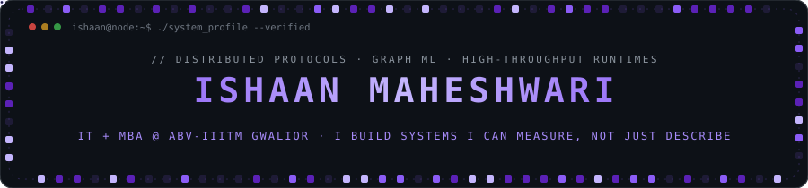
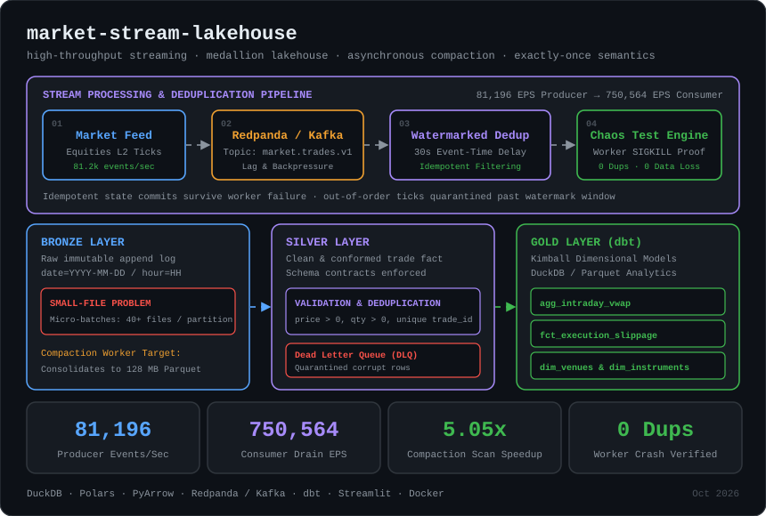
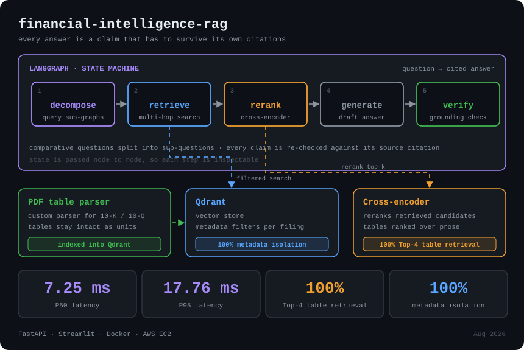
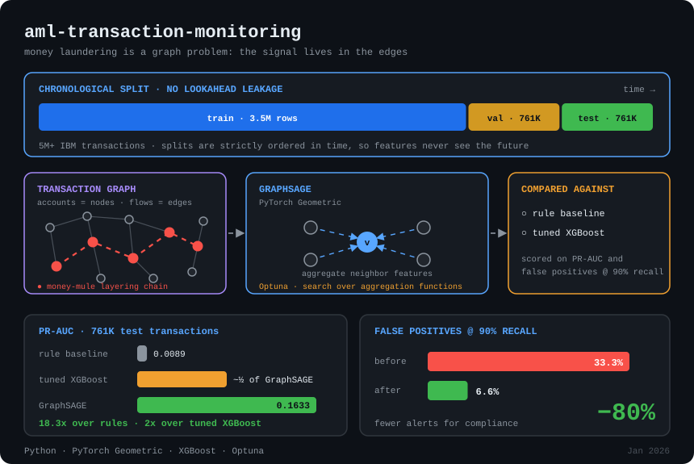
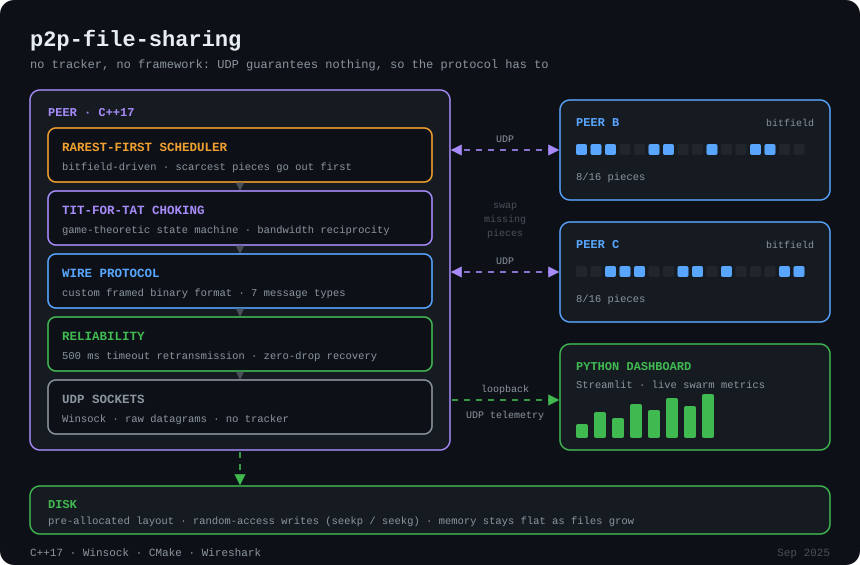

<div align="center">




<br/>
<p align="center">
  <a href="https://www.linkedin.com/in/ishaan-maheshwari-967741292">
    
  </a>

  <a href="mailto:ishaan.maheshwari101@gmail.com">
    
  </a>
</p>


</div>


## About

**Integrated B.Tech (IT) + MBA student at ABV-IIITM Gwalior** (Aug 2023 – May 2028). I engineer at the intersection where machine learning meets high-performance systems: retrieval pipelines with zero tolerance for hallucination, graph neural networks evaluated without temporal leakage, and socket-level network protocols you can watch recover under Wireshark packet drops.

> **The thesis behind everything I build:** A system isn't finished when it runs without errors once. It is finished when I can put a hard number on it (latency percentiles, PR-AUC, false-positive rate at fixed recall) and explain mechanically why that number moved.

### Quick facts

| | |
|---|---|
| **Program** | Integrated B.Tech in IT + Master of Business Administration (MBA), ABV-IIITM Gwalior |
| **Duration** | Aug 2023 – May 2028 · Gwalior, India |
| **Languages** | C++, Python, JavaScript, SQL, C |
| **Focus areas** | Distributed systems · network protocols · Graph ML · RAG pipelines & vector search |
| **Problem solving** | **500+ DSA problems** solved in C++ on LeetCode |
| **Competitive exam** | **JEE Main 2023 · 98.6 percentile** among 1.1M+ candidates nationwide |
| **Contact** | [ishaan.maheshwari101@gmail.com](mailto:ishaan.maheshwari101@gmail.com) · [LinkedIn](https://www.linkedin.com/in/ishaan-maheshwari-967741292) |

### Project timeline

| Date | System | Core measured outcome |
|---|---|---|
| Oct 2026 | **MarketStream Lakehouse Platform** | 81k EPS ingestion · 5.05x small-file compaction speedup · exactly-once chaos verified |
| Aug 2026 | **SEC Financial Intelligence RAG Engine** | 7.25 ms P50 latency · 100% Top-4 table retrieval · zero-leakage payload isolation |
| Jan 2026 | **GraphSAGE AML Transaction Monitoring** | 18.3x PR-AUC gain over rules (0.0089 → 0.1633) · 80% false-positive cut at 90% recall |
| Sep 2025 | **Decentralized P2P File Sharing Engine** | Trackerless C++17 UDP protocol · zero-drop swarm recovery · O(1) memory persistence |


<div align="center">


<h2>SELECTED WORK</h2>


</div>

### [MarketStream Lakehouse](https://github.com/ishaaaan17/market-stream-lakehouse) — High-Throughput Stream Processing & Medallion Lakehouse

> `[ DuckDB ] [ Polars ] [ PyArrow ] [ Redpanda / Kafka ] [ dbt ] [ Parquet / Iceberg ] [ Exactly-Once ]`

A high-throughput financial market stream processing engine and Medallion Lakehouse platform built to handle **80,000+ events/sec**. Solves the three primary failure modes of real-time streaming architectures: the Lakehouse **Small-File Problem** via an autonomous compaction worker, **at-least-once duplicate corruption** via deterministic event-time watermarking, and **consumer worker crashes** verified via automated chaos testing.

<p align="center">
  
</p>

| Pipeline Dimension | Empirical Benchmark | Engineering Significance |
|---|---|---|
| **Producer Ingestion Throughput** | **81,196 events/sec** | High-frequency multi-venue equities order flow |
| **Consumer & Dedup Drain Rate** | **750,564 events/sec** | Monotonic watermarking & in-memory state tracking |
| **Compaction Scan Acceleration** | **5.05x FASTER** | Scan latency dropped from **13.98 ms → 2.77 ms** |
| **Lakehouse Storage Compression** | **18.94% reduction** | Consolidated dictionary encoding & row group striping |
| **Worker Crash Fault Tolerance** | **0 Duplicates · 0 Lost Records** | Exactly-Once state verified after forceful `SIGKILL` termination |

**Battle-tested architectural decisions**
- **Solving the Small-File Problem (`CompactionWorker`):** Micro-batch streaming writes small 20KB–500KB Parquet files that cause metadata thrashing and disk seek bottlenecks. The autonomous compaction engine gathers fragmented partitions exceeding threshold (`min_files = 4`), merges Arrow tables in zero-copy chunks, and writes consolidated 128MB Parquet files, accelerating analytical query scans by **5.05x**.
- **Event-Time Watermarking & Idempotent Deduplication:** Maintains a monotonic high-water mark with a 30-second bounded delay window, quarantining out-of-order ticks from disparate exchanges while deduplicating replayed primary keys idempotently.
- **Chaos Engineering & Exactly-Once Semantics:** Forcefully terminates consumer processes mid-flight (`SIGKILL`) with injected duplicate bursts and late ticks; replayed broker streams recover state with zero duplicate trades and zero lost executions.
- **Medallion Architecture & Kimball Data Marts:** Raw immutable Bronze append logs promote to cleaned Silver fact tables with Dead-Letter Queue (DLQ) quarantine, feeding Gold marts (`agg_intraday_vwap`, `fct_execution_slippage`, `dim_venues`) with strict dbt data contract assertions.

`Python` `DuckDB` `Polars` `PyArrow` `Redpanda` `dbt` `Streamlit` `Docker` `Medallion Architecture`

---

### [SEC Financial Intelligence RAG Engine](https://github.com/ishaaaan17/financial-intelligence-rag) — Autonomous Multi-Hop RAG over 10-K / 10-Q Filings

> `[ LangGraph ] [ Qdrant ] [ RAG ] [ grounding verification ] [ FlashRank ] [ $0 Cloud Stack ]`

Financial regulatory filings are a notoriously hostile retrieval target: essential numerical answers live inside dense, multi-column financial statements, comparative questions cross arbitrary quarters, and an ungrounded hallucination is worse than a hard refusal. This is an autonomous, multi-hop retrieval and reasoning engine for SEC 10-K and 10-Q documents, orchestrated as a **LangGraph state machine** over a **Qdrant** vector store with local cross-encoder reranking.

<p align="center">
  
</p>

| Metric | Result | Engineering context |
|---|---|---|
| **P50 / P95 Latency** | **7.25 ms · 17.76 ms** | Filtered vector search + local reranking pass |
| **Metadata Isolation** | **100%** | Query-time Qdrant payload filters prevent cross-quarter bleed |
| **Table Retrieval** | **100% Top-4** | Custom table parsing prioritizes tables over narrative boilerplate |
| **Inference Cost** | **$0.00** | Groq (`llama-3.3-70b`) + local embeddings (`all-MiniLM-L6-v2`) |

**Battle-tested architectural decisions**
- **DEC-005 — Database-level metadata isolation over application filtering:** Naive vector search over multi-quarter corpora risks retrieving chunks from the wrong quarter if semantic embeddings are close. Enforced `ticker`, `fiscal_year`, and `fiscal_period` as indexed payload filters evaluated *at query time* inside Qdrant. This prevents cross-period context contamination by construction rather than post-hoc filtering.
- **DEC-009 — Table-preserving extraction (`pdfplumber`):** Generic PDF loaders destroy column alignment when extracting financial tables. Implemented table-aware extraction with Markdown table serialization, tagging chunks as `type: table` so tabular data retains mathematical structure.
- **DEC-006 — Local Cross-Encoder Reranking (`FlashRank`):** Narrative disclosures (risk factors, boilerplate) often match raw query keywords better than numbers. Applied a local `ms-marco-TinyBERT-L-2-v2` cross-encoder reranking pass in single-digit milliseconds, lifting financial balance sheets to the top of the context window.
- **DEC-007 & DEC-014 — Two-pass synthesis with bounded hallucination recovery:** A single prompt that generates and "self-checks" its own output routinely confirms its own errors. Decoupled generation into `generate_comparison` and an independent `verify_grounding` node. If grounding checks fail, a bounded retry loop (`MAX_GENERATION_RETRIES = 1`) triggers regeneration with explicit context before safely falling back to `handle_missing_data`.
- **DEC-015 — Bounded backoff and observability:** Wrapped LLM chains in `tenacity` exponential backoff restricted strictly to transient faults (rate limits, timeouts), with structured per-node latency logging.

`Python` `LangGraph` `Qdrant Cloud` `AWS EC2` `Docker` `FastAPI` `Streamlit` `FlashRank` `pdfplumber` `Groq`

---

### [GraphSAGE AML Transaction Monitoring](https://github.com/ishaaaan17/aml-transaction-monitoring) — Graph Neural Networks for Money-Mule Detection

> `[ GraphSAGE ] [ PyTorch Geometric ] [ XGBoost ] [ fraud / AML ] [ Optuna ] [ leakage-free ML ]`

Money laundering is fundamentally a relational graph problem: individual transactions look completely legitimate in tabular rows, while the illicit pattern exists in cyclic layering, fan-out distributions, and multi-hop mule account chains. Modeled **5M+ IBM transactions** as a dynamic graph and trained an inductive **GraphSAGE** classifier to flag money-mule laundering typologies that conventional rule engines miss.

<p align="center">
  
</p>

| Model | PR-AUC | False-Positive Rate @ 90% Recall | Architecture notes |
|---|---|---|---|
| **Rule Baseline** | 0.0089 | 33.28% | Industry standard heuristic rules |
| **Tuned XGBoost** | 0.0830 | 11.38% | Tabular gradient boosting (Optuna-tuned) |
| **GraphSAGE (GNN)** | **0.1633** | **6.58%** | **18.3x over rules · 2x over XGBoost · 80% fewer alerts** |

**Battle-tested architectural decisions**
- **Linear chain graph vs. explosive all-pairs line graph:** Connecting all transaction pairs sharing an account would produce **~14 billion edges** from the single largest hub account alone (168,672 transactions), exceeding hardware limits. Engineered a chronological chain graph where each transaction links only to its temporal neighbor per account, keeping edge complexity linear (~1.82 average degree) while preserving layering typology sequences.
- **Evaluation trap: `average_precision_score` vs invalid `auc()`:** Discovered that trapezoidal `auc(recall, precision)` interpolates linearly between PR points, artificially overestimating step-function scores by up to 3.7x on discrete baselines. Switched strictly to Average Precision scoring.
- **Strict chronological split (no lookahead leakage):** Velocity and temporal features depend on history. Standard random cross-validation leaks future transactions into historical windows. Enforced strict 70/15/15 chronological quantile splitting (3.5M train / 761K val / 761K test).
- **Dataset artifact detection:** Identified an uncharacteristic background traffic collapse in the raw IBM dataset after Day 10; restricted training window to Days 1–10 to avoid training on degenerate synthetic artifacts.
- **Optuna GNN optimization:** Evaluated neighbor aggregation functions (mean, lstm, max-pooling) under a 4GB VRAM constraint (RTX 3050), opting for GraphSAGE over memory-intensive GAT attention layers.

`Python` `PyTorch Geometric` `GraphSAGE` `XGBoost` `Optuna` `scikit-learn` `temporal validation` `PR-AUC`

---

### [Decentralized P2P File Sharing Engine](https://github.com/ishaaaan17/p2p-file-sharing) — Trackerless Protocol over Raw UDP in C++17

> `[ C++17 ] [ Winsock ] [ UDP sockets ] [ protocol design ] [ game theory ] [ Wireshark ]`

A decentralized peer-to-peer file distribution protocol written in C++17 from the socket layer up, with zero external networking libraries and no centralized tracker. Because raw UDP provides neither ordering nor delivery guarantees, protocol reliability, piece scheduling, anti-leeching game theory, and disk persistence were engineered directly into the software architecture.

<p align="center">
  
</p>

| Component | Engineering mechanism | Key property |
|---|---|---|
| **Wire Protocol** | 7-type custom framed binary format (`SYN`, `SYN_ACK`, `DATA`, `ACK`, `FIN`, `CHOKE`, `UNCHOKE`) | Compact byte packing over raw UDP |
| **Reliability** | 500 ms sweep retransmission timer, up to 5 retries | Zero-drop packet recovery across swarms |
| **Scheduling** | Rarest-first bitfield scheduler across peer snapshots | Speeds piece propagation, eliminates bottlenecks |
| **Fairness** | Tit-for-Tat game-theoretic choking state machine | Enforces bandwidth reciprocity, prevents leechers |
| **Storage** | Pre-allocated disk layout with `seekp`/`seekg` random writes | Flat O(1) RAM usage regardless of transfer size |
| **Telemetry** | Non-blocking loopback UDP socket dispatch (:6000) to Python | Real-time Streamlit swarm dashboard, Wireshark verified |

**Battle-tested architectural decisions**
- **Decoupled threading model (`SocketManager`):** Dedicated background listener thread runs a blocking `recvfrom()` loop, deserializing datagrams into `Packet` structures and pushing to a thread-safe queue. The main loop polls at 10 ms intervals, completely isolating socket IO from scheduling state machines.
- **Zero-allocation direct-to-disk persistence (`PieceManager`):** Rather than caching multi-megabyte payloads in memory, `initialize_file_layout()` pre-allocates zero-filled files on startup. Inbound chunks are written directly to exact offsets via `seekp(piece_idx * piece_size)` under mutex protection.
- **Rarest-first swarm distribution:** Peers evaluate connected bitfield rarity counts to request least-frequent pieces first, preserving rare chunks from dropping offline if seeders exit.
- **Bandwidth reciprocity (`ChokeManager`):** Evaluates upload vs. download byte ratios per peer; sends `CHOKE` frames to uncooperative nodes to incentivize balanced contribution.

`C++17` `Winsock` `raw UDP datagrams` `CMake` `Wireshark` `GoogleTest` `Streamlit` `multithreading`

---

## What these projects have in common

| Engineering Habit | How it shows up in my work |
|---|---|
| **Measure, then claim** | Verified P50/P95 latencies, PR-AUC improvements, and false-positive drops at fixed recall thresholds. |
| **Evaluate without leakage** | Strict chronological quantile splitting, tuned comparative baselines, and ground-truth validation nodes. |
| **Own the stack end-to-end** | Raw binary sockets in C++17, custom inductive GNN training in PyTorch, state machine orchestration in LangGraph. |
| **Inspectable by design** | Packet-level Wireshark captures, live UDP telemetry streams, and citation-level grounding checks on every LLM claim. |


```
──────────────────────────────  A R S E N A L  ──────────────────────────────
```

<div align="center">


</div>

| Area | Tools & Core Competencies |
|---|---|
| **Data Engineering & Lakehouse** | Stream processing, event-time watermarking, Medallion Architecture (Bronze/Silver/Gold), DuckDB, Polars, PyArrow, Redpanda / Kafka, dbt, Apache Iceberg, Parquet compaction, exactly-once idempotency |
| **Systems & Networking** | Distributed systems, multithreading, socket programming (TCP/raw UDP), Winsock, wire protocols, Linux |
| **Machine Learning & AI** | PyTorch, PyTorch Geometric, Graph Neural Networks (GraphSAGE), XGBoost, RAG, Qdrant, LangGraph, Optuna |
| **Backend & Infrastructure** | FastAPI, Docker, Docker Compose, AWS EC2, Git, CI/CD GitHub Actions, CMake, GoogleTest |
| **Coursework** | Data Structures & Algorithms · Computer Networks · Operating Systems · DBMS · Distributed Systems · Systems Programming |

---

## Beyond Code

- **Algorithmic Problem Solving:** 500+ Data Structures and Algorithms problems solved in C++ on LeetCode.
- **Leadership & Communication:** Managed technical documentation, presentations, and operations for 5+ flagship events during the Annual Technical Festival at ABV-IIITM Gwalior.
- **Academic Distinction:** Scored **98.6 percentile** in JEE Main 2023 nationwide among 1.1M+ candidates.


```
────────────────────  C O M M I T   H I S T O R Y  ────────────────────
```

<div align="center">


<br/><br/>


<br/><br/>

## Let's talk

If you are building systems where latency, correctness, or scalability needs to be measured and proven rather than assumed, I'd love to connect.


<br/>

[](mailto:ishaan.maheshwari101@gmail.com)
[](https://www.linkedin.com/in/ishaan-maheshwari-967741292)


</div>
